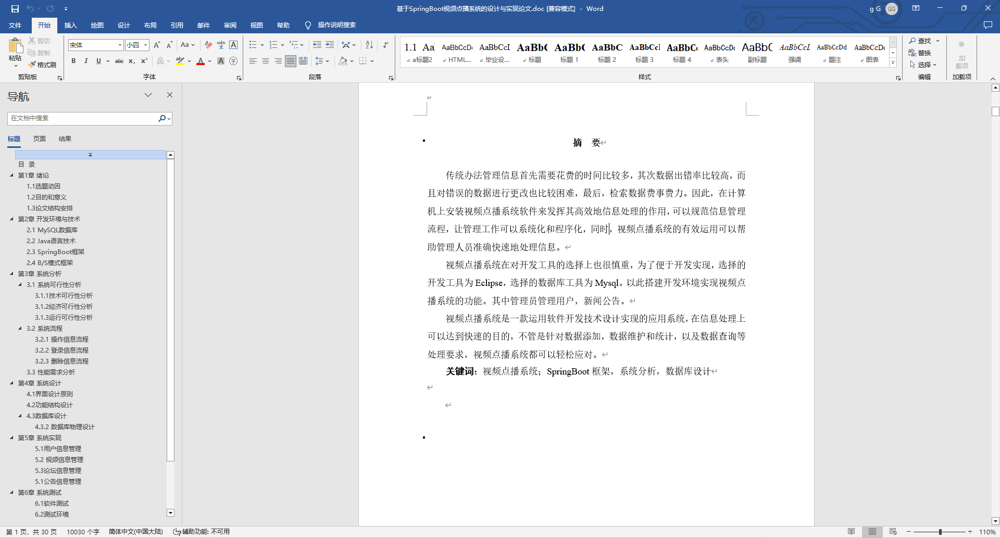
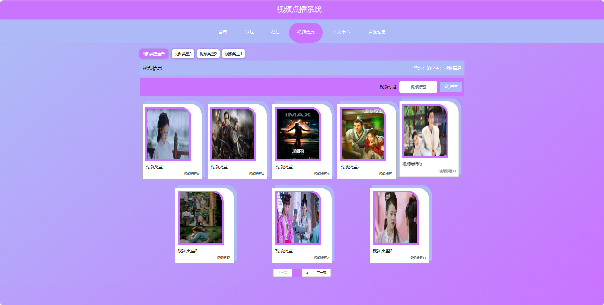
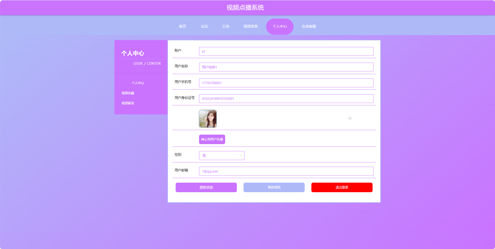
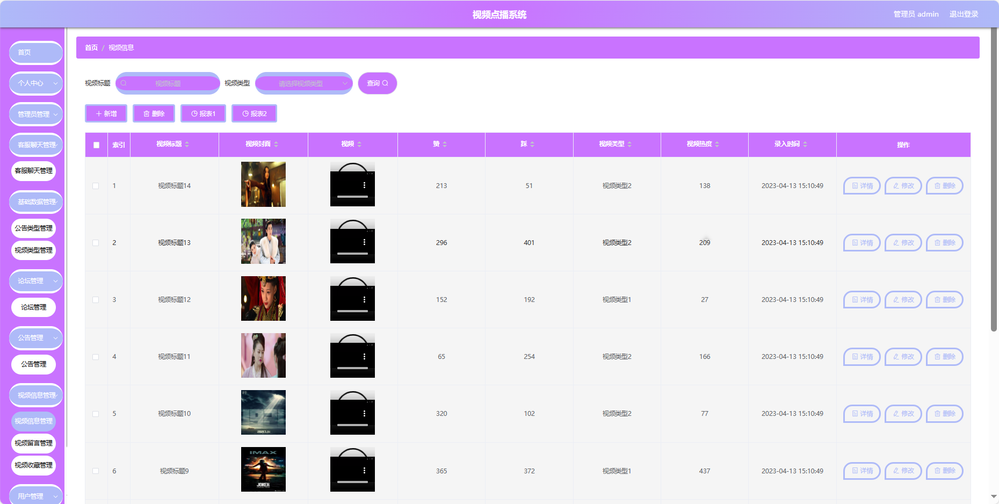
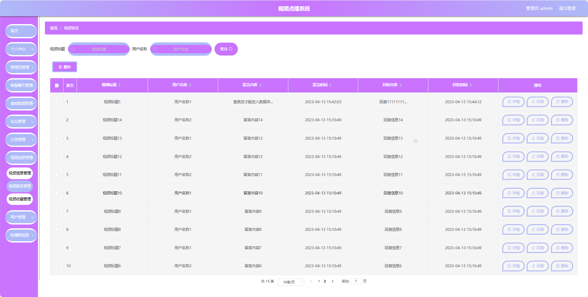
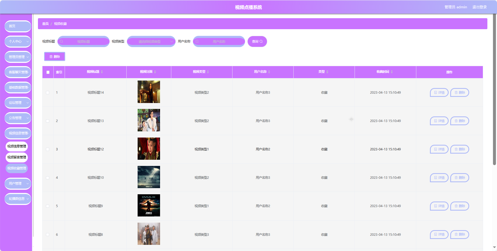
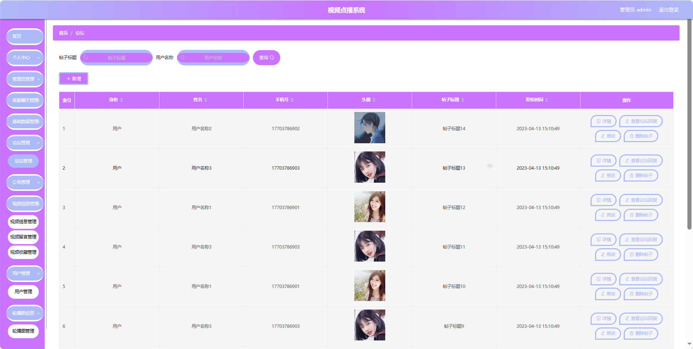

## 基于SpringBoot的视频点播系统(程序+报告)

###  获取sql数据库文件: 从戎源码网 (https://armycodes.com/) QQ: 386869957 QQ群: 377586148
###  所有系统地址: (https://github.com/YuLin-Coder/AllProjectCatalog) 
###  所有项目以及源代码本人均调试运行无问题 可支持远程安装部署调试、定制修改、代码讲解

## 项目介绍
基于SpringBoot的视频点播系统，系统包含两种角色：管理员、用户主要功能如下。

### 【管理员】:
1. 首页：查看系统整体情况。
2. 个人中心：管理管理员的个人信息。
3. 管理员管理：维护系统管理员的账户信息。
4. 客服聊天管理：查看和处理用户的在线聊天记录。
5. 基础数据管理：管理系统的基础数据，如视频分类等。
6. 论坛管理：管理视频讨论论坛，审核和回复帖子。
7. 公告管理：发布、编辑和管理系统的公告信息。
8. 视频信息管理：添加、编辑和删除视频信息。
9. 用户管理：查看和管理系统的用户信息。
10. 轮播图信息：管理系统首页的轮播图展示。

### 【用户】:
1. 首页：浏览系统。
2. 论坛：参与视频讨论、提问和分享观点。
3. 公告：获取系统发布的重要公告和通知。
4. 视频信息：查看视频列表、详情和相关信息。
5. 个人中心：管理个人信息、查看观看历史和收藏的视频。
6. 在线客服：与客服人员进行实时在线沟通。

## 项目技术
- 编程语言：Java
- 数据库：MySQL
- 项目管理工具：Maven
- 前端技术：HTML、CSS、JavaScript、Jquery、Vue
- 后端技术：Spring、SpringMVC、MyBatis

## 运行环境
- JDK版本：JDK1.8及以上
- 开发工具：IDEA、Ecplise、Myecplise都可以
- 数据库: MySQL5.7及以上
- Maven：maven3.0及以上
- Node：14.14.0及以上

## 运行截图

